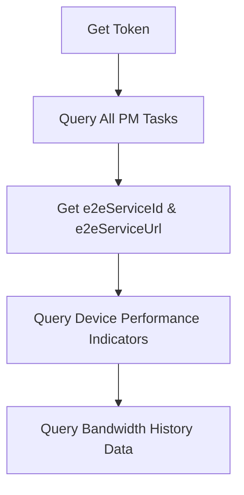

# API Documentation

Welcome to the REST API documentation for RCView Network Management System. This documentation provides comprehensive guides for all available APIs.

## Overview

RCView adopts a B/S (Browser/Server) architecture. All interfaces have corresponding REST API endpoints on the backend, allowing users to retrieve resource information, query alarm information, and push configurations by calling these APIs. 

AFTER RCView 3.2.10，Do Not Need “Step 1:Enabling REST API Functionality”.

# Overall Introduction

RCView adopts a B/S (Browser/Server) architecture. All interfaces have corresponding REST API endpoints on the backend, allowing users to retrieve resource information, query alarm information, and push configurations by calling these APIs.

## Getting Started

### Authentication

**Note:** Starting from RCView 3.2.10, you do NOT need "Step 1: Enabling REST API Functionality".

1. **Get Access Token**
   
   First authenticate yourself to obtain an access token. See [getToken](getToken.md) for details.
   
   **Important:** The validity period of the token is 15 minutes by default. After expiration, the API will prompt a verification failure, and a new token will need to be requested.

2. **Making Requests with Token**
   
   Send requests using appropriate HTTP methods. For all HTTP requests, you must add the token data obtained from [getToken](getToken.md) to the `Authentication-Token` header:
   
   ```http
   GET /api/v1/resource HTTP/1.1
   Host: example.com
   Content-Type: application/json
   Authentication-Token: WyIwIiwiY2M2NDA1MTVkYmE5ZTQ5NDEyZGIyYmVkNThkNWJhMGUiXQ.DTivLg.hK1nnOeqWu9BUeY6apcfwSq2u6g
   ```

3. **Handling Responses**
   
   Parse the returned data according to the specific API documentation.

## API Categories

### 🔐 Authentication APIs
- **[Token API](getToken.md)** - Get authentication token for API access

### 📡 EMS (Element Management System) APIs

#### Device Management
- **[LLDP API](EMS/lldp.md)** - Query LLDP neighbor information

#### iTN8600-A Series
- **[Query Optical Transceiver Information](EMS/8600/query_optical_transceiver_information.md)** - Query optical module information for specific cards

### 📊 PM (Performance Management) APIs

#### Performance Data Collection
- **[Query All PM Tasks](PM/query_all_pm_tasks.md)** - Query all PM task configurations
- **[Query Device Performance Indicators](PM/query_device_performance_indicators.md)** - Query specific NE performance metrics
- **[Query Bandwidth History Data](PM/query_bandwidth_history_data.md)** - Query historical bandwidth data
- **[Query Port+VLAN Rate Limit](PM/query_port_vlan_rate_limit.md)** - Query port and VLAN rate limiting configuration

### 📈 TWAMP (Two-Way Active Measurement Protocol) APIs

#### SLA Measurement
- **[Query All TWAMP Tasks](TWAMP/query_all_twamp_tasks.md)** - Query all TWAMP task information
- **[Query TWAMP Task Detailed Information](TWAMP/query_twamp_detailed_information.md)** - Query detailed TWAMP task configuration
- **[Query TWAMP Task Performance Information](TWAMP/query_twamp_task_performance_information.md)** - Query TWAMP performance metrics (availability, latency, jitter, packet loss)

### 📦 Inventory APIs

#### Resource Inventory
- **[NE (Network Element)](INVENTORY/NE.md)** - Query network element list
- **[TOPO LINK](INVENTORY/TOPOLINK.md)** - Query topology link information

## Quick Start Guide

### 1. Performance Monitoring Workflow



### 2. TWAMP SLA Measurement Workflow

```
1. Query All TWAMP Tasks → Get e2eServiceId
2. Query Task Details → Get IP/Port configuration
3. Query Performance Data → Get availability/latency/jitter/loss metrics
```

### 3. Device Management Workflow

```
1. Query NE List → Get device information
2. Query LLDP → Get neighbor topology
3. Query Optical Modules → Get transceiver status
```


## Common Response Codes

| Code | Description |
|------|-------------|
| 0 | Success |
| Other | Refer to specific API documentation |

## Data Format

All APIs use JSON format for requests and responses.

### Request Headers
```
Content-Type: application/json
Authentication-Token: <your_token_here>
```

### Response Format
```json
{
    "code": 0,
    "msg": "Operation is Successful",
    "data": {...}
}
```

## Additional Resources

- **[PM API Complete Documentation](PM/REST_API_Documentation_PM_V3.0.md)** - Combined PM API reference
- **[Video Tutorial]** - Watch the demonstration video below

## Video Example

